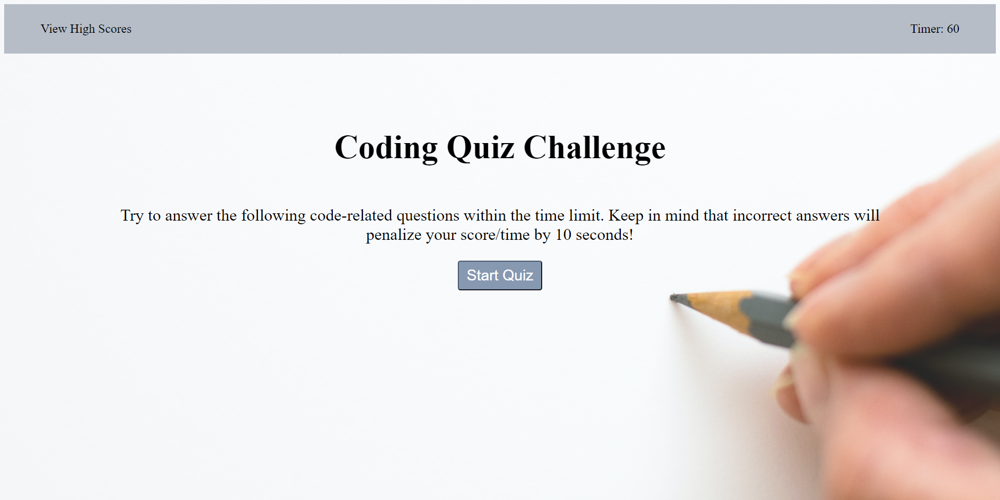
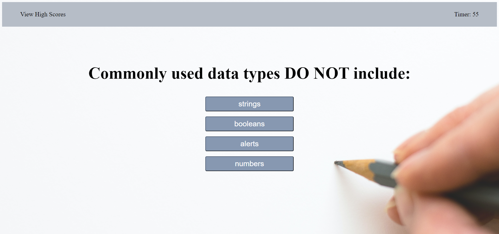
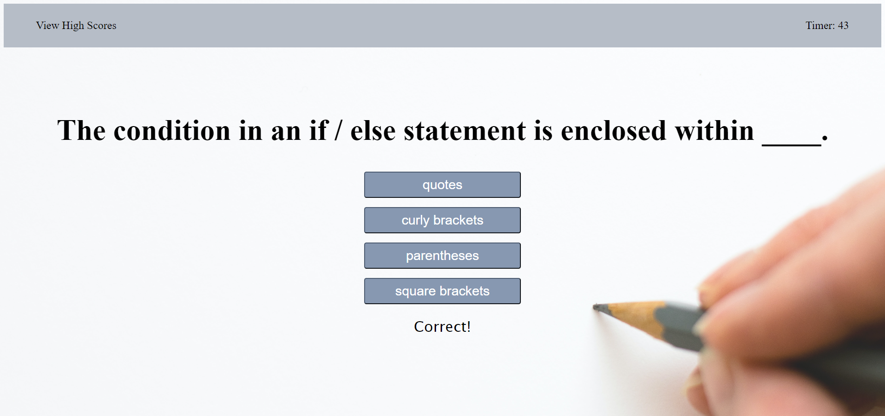

# Code Quiz

## Description

In this challenge, I was asked to build a timed coding quiz with multiple-choice questions. This assignment had no starter code.

## Table of Contents 

Please refer to Table Of Contents.
- [Criteria](#criteria)
- [Screenshot](#screenshot)
- [Link To Deployed Application](#link-to-deployed-application)

## Criteria

-AS A coding boot camp student
-I WANT to take a timed quiz on JavaScript fundamentals that stores high scores
-SO THAT I can gauge my progress compared to my peers

-GIVEN I am taking a code quiz
-WHEN I click the start button
-THEN a timer starts and I am presented with a question
-WHEN I answer a question
-THEN I am presented with another question
-WHEN I answer a question incorrectly
-THEN time is subtracted from the clock
-WHEN all questions are answered or the timer reaches 0
-THEN the game is over
-WHEN the game is over
-THEN I can save my initials and score

CREDIT NOTES: I worked with a tutor and office hours for guidance.

## Screenshot 

Please reference the gif and photos for the Code Quiz Project.

## Link To Deployed Application

Please refer to deployed application directly:

[Code Quiz](https://susorocode.github.io/code-quiz/)